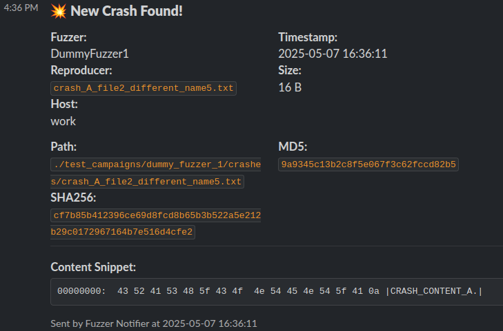

# Fuzzer Crash Notifier

Automated monitoring for your fuzzing campaigns. Get instant Email and/or Slack notifications for new, unique crashes.



## Key Features

- **Real-time Monitoring:** Uses `watchdog` (with polling fallback) to detect new crash files.
- **Deduplication:** Identifies unique crashes by content hash (SHA256 per fuzzer campaign) to prevent alert fatigue from duplicate findings.
- **Multi-Fuzzer:** Monitor crash directories from libAFL, AFL++, libFuzzer, etc., simultaneously.
- **Configurable Notifiers:**
  - **Email:** SMTP-based alerts.
  - **Slack:** Rich, Block Kit formatted messages to Slack channels.
- **Informative Alerts:** Notifications include fuzzer name, timestamp, filename, path, size, MD5/SHA256 hashes, hostname, and a configurable content snippet (text or hexdump).
- **Hot-Reloading Config:** Update `config.json` on the fly (e.g., add new fuzzers) without restarting the service or losing reported crash history.
- **Persistent State:** Tracks reported unique crashes in a local file to maintain state across restarts.
- **File Logging:** Detailed operational logs in `notifier.log`.

## Prerequisites

- Python 3.10+
- [uv](https://github.com/astral-sh/uv) (for installing and managing dependencies from `pyproject.toml`).

## Quick Start

1.  **Get the Code & Dependencies:**
    Clone the repository. `uv` will handle installing dependencies based on `pyproject.toml` and `uv.lock`.

    ```bash
    git clone https://github.com/tiiuae/fuzz_crash_notifier.git
    cd fuzz_crash_notifier
    uv venv                 # Create a virtual environment (recommended)
    source .venv/bin/activate # Activate the virtual environment (Linux/macOS)
    # For Windows: .venv\Scripts\activate
    uv pip install .  # This installs the current project and its dependencies
    ```

    _If you don't have `uv` installed, follow the instructions on the [uv GitHub page](https://github.com/astral-sh/uv)._

2.  **Create `config.json`:**
    In the same directory as the script, create a `config.json` file. See the example below and customize it:

    ```json
    // Minimal config.json example
    {
      "notifiers": {
        "slack": {
          "enabled": true,
          "webhook_url": "YOUR_SLACK_INCOMING_WEBHOOK_URL"
        }
      },
      "fuzzers_to_watch": [
        {
          "name": "MyLibFuzzerCampaign",
          "crash_dir": "/path/to/libfuzzer_target/crashes"
        },
        {
          "name": "MyAFLPlusPlusCampaign",
          "crash_dir": "/srv/fuzzing/afl_output/target_x/crashes"
        }
      ],
      "reported_unique_crashes_file": "reported_unique_crashes.txt",
      "slack_message_options": {
        // Optional: for snippet & hostname
        "show_content_snippet": true,
        "content_snippet_format": "hexdump",
        "include_hostname": true
      }
    }
    ```

    _(See "Configuration Details" section below for all options.)_

3.  **Run the Notifier:**
    Ensure your virtual environment (if created) is active.

    ```bash
    python notify.py
    ```

4.  **Run in Background (Recommended for long campaigns):**
    ```bash
    nohup python notify.py > notifier_daemon.log 2>&1 &
    ```
    (Or use `screen`, `tmux`, or set up as a systemd service.)

## How It Works

1.  **Load & Initialize:** The script loads `config.json` and the history of reported unique crash hashes.
2.  **Monitor Directories:** It watches the `crash_dir` for each configured fuzzer using `watchdog` (or polling).
3.  **Process New Files:**
    - Filters out tiny files.
    - Calculates the SHA256 hash of the file content.
    - Checks if `FuzzerName::SHA256Hash` has been reported before for that fuzzer.
4.  **Notify (if new unique crash):**
    - Gathers crash metadata (timestamp, path, size, hashes, snippet).
    - Sends alerts via enabled Email/Slack.
    - Records `FuzzerName::SHA256Hash` as reported.
5.  **Hot-Reload:** Periodically checks `config.json` for changes and reloads settings and monitoring targets without interrupting deduplication state.

## Configuration Details (`config.json`)

The `config.json` file controls the notifier's behavior.

| Key                                                            | Type    | Default Value                   | Description                                                                                           |
| :------------------------------------------------------------- | :------ | :------------------------------ | :---------------------------------------------------------------------------------------------------- |
| `notifiers.email.enabled`                                      | boolean | `false`                         | Enable email notifications.                                                                           |
| `notifiers.email.smtp_server`                                  | string  |                                 | SMTP server hostname.                                                                                 |
| `notifiers.email.smtp_port`                                    | integer | `587`                           | SMTP server port.                                                                                     |
| `notifiers.email.smtp_user`                                    | string  |                                 | SMTP username.                                                                                        |
| `notifiers.email.smtp_password`                                | string  |                                 | SMTP password or app password.                                                                        |
| `notifiers.email.recipient_email`                              | string  |                                 | Email address to send notifications to.                                                               |
| `notifiers.slack.enabled`                                      | boolean | `false`                         | Enable Slack notifications.                                                                           |
| `notifiers.slack.webhook_url`                                  | string  |                                 | Slack Incoming Webhook URL.                                                                           |
| `fuzzers_to_watch`                                             | array   | `[]`                            | List of fuzzer campaigns to monitor. Each object needs `name` (string) and `crash_dir` (string path). |
| `reported_unique_crashes_file`                                 | string  | `"reported_unique_crashes.txt"` | File to store `FuzzerName::SHA256Hash` of reported crashes for deduplication.                         |
| `min_crash_file_size_bytes`                                    | integer | `1`                             | Minimum file size (bytes) to consider as a crash.                                                     |
| `check_interval_seconds`                                       | integer | `10`                            | Polling interval (seconds) if `watchdog` is unavailable.                                              |
| `config_check_interval_seconds`                                | integer | `60`                            | How often to check `config.json` for changes.                                                         |
| `watchdog_file_settle_delay_ms`                                | integer | `500`                           | Delay (ms) after file creation (in watchdog mode) before processing, to ensure file is fully written. |
| `slack_message_options.show_content_snippet`                   | boolean | `true`                          | Include content snippet in Slack messages.                                                            |
| `slack_message_options.content_snippet_format`                 | string  | `"hexdump"`                     | Snippet format: `"hexdump"` or `"text"`.                                                              |
| `slack_message_options.content_snippet_hexdump_bytes`          | integer | `64`                            | Total bytes for hexdump snippet.                                                                      |
| `slack_message_options.content_snippet_hexdump_bytes_per_line` | integer | `16`                            | Bytes per line in hexdump.                                                                            |
| `slack_message_options.content_snippet_max_lines`              | integer | `5`                             | Max lines for text snippet.                                                                           |
| `slack_message_options.content_snippet_max_bytes_per_line`     | integer | `100`                           | Max bytes per line for text snippet (before truncation).                                              |
| `slack_message_options.content_snippet_text_max_total_bytes`   | integer | `1024`                          | Max total bytes to read for text snippet.                                                             |
| `slack_message_options.include_hostname`                       | boolean | `true`                          | Include notifier's hostname in Slack messages.                                                        |

**Note on `crash_dir` paths:**

- **LibAFL/AFL++:** Typically `output_dir/[instance_name_if_distributed]/crashes/`.
- **LibFuzzer:** The directory specified by `-artifact_prefix=path/to/dir/`, or the current working directory if not used.

## Future Enhancements

- [ ] Throttling/Debouncing notifications.
- [ ] Option to attach/upload reproducers.
- [ ] Extract crash type/signal from output if available.
- [ ] Support for more notification platforms (Discord, MS Teams).
- [ ] Interactive Slack elements (e.g., Acknowledge, Triage).

## Contributing

Contributions, issues, and feature requests are welcome!

## License

This project is licensed under the Apache-2.0 License. See the [LICENSE](LICENSE) file for details.
